# OpenCV代码一点基础知识
+ Mat 类
    + 是存储和操作 OpenCV 中图像的主要数据结构。
    + 用于密集的 n 维单通道或多通道数组。实际上它可以存储实数或复数值向量和矩阵、彩色图像或灰度图像、直方图、点云等。
    + 有许多种不同的方式可用来创建一个 Mat 对象，最流行的方法是构造函数，其数组的大小和类型被指定为：
        > `Mat(nrows,ncols,type,fillValue)`
    
    
    数组元素的初始值可以由 Scalar 类设置为一个典型的四元素向量（对于存储在数组中的图像的每个 RGB 和透明度分量）。下面展示 Mat 的一个使用示例：

    ```c++
        Mat img_A(4,4,CV_8U,Scalar(255));
        //白色图像；
        //具有 8 位无符号整数的 4x4 单个通道数组
        //（最多 255 个值，对灰度图像有效，例如，255=白色）
    ```
+ at方法：用于获取图像矩阵某点的值或改变某点的值。
        + 单通道图像：`mat.at<uchar>(row,col)`
        + 三通道图像：

        对于三通道来说，每一个像素的位置内含了三个uchar数据，所以对三通道获取像素值要使用Vec3b。Vec3b实质上是一个uchar的数组，最多能装三个数据。
    ```c++
        Vec3b i = image.at<Vec3b>(i,j);
        //返回一个Vec3b类型的数组
    ```

+ `Mat imread( const String& filename, int flags )`
    + 第一个参数是图片路径，不支持"\\"形式的路径
    + 第二个参数是flag

         flags = -1：imread按解码得到的方式读入图像

         flags = 0：imread按单通道的方式读入图像，即灰白图像

        flags = 1：imread按三通道方式读入图像，即彩色图像
+ `void cvtColor(InputArray src, OutputArray dst, int code, int dstCn=0 );`
    + 函数的作用是将一个图像从一个颜色空间转换到另一个颜色空间
    + InputArray src: 输入图像即要进行颜色空间变换的原图像，可以是Mat类 

    + OutputArray dst: 输出图像即进行颜色空间变换后存储图像，也可以Mat类 
    + int code: 转换的代码或标识，即在此确定将什么制式的图片转换成什么制式的图片.
    + int dstCn = 0: 目标图像通道数，如果取值为0，则由src和code决定
+ `void imshow(const string& winname, InputArray mat);`
    + 第一个参数，const string&类型的winname，填需要显示的窗口标识名称。
    + 第二个参数，InputArray 类型的mat，填需要显示的图像。
# 数字图像描述
+ 黑白图像

    指图像的每个像素只能是黑或者白，没有中间的过渡，故又称为２值图像。2值图像的像素值为0、1。

    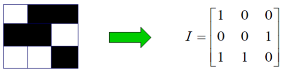
+ 灰度图像

    灰度图像是指每个像素的信息由一个量化的灰度级来描述的图像，没有彩色信息。

    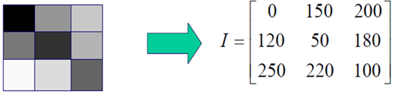
+ 彩色图像

    彩色图像是指每个像素的信息由RGB三原色构成的图像，其中RBG是由不同的灰度级来描述的。

    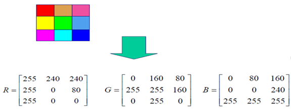
+ 数字图像表示：

  令f(s, t)表示一幅具有两个连续变量s和t的连续图像函数。通过取样和量化， 我们可把该函数转换为数字图像。将该连续图像取样为一个二维阵列f(x,y)， 该阵列有M行和N列，其中(x,y)是离散坐标。

    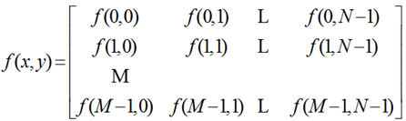
     
     在某些讨论中，使用传统的矩阵表示法来表示数字图像及其像素更为方便：

     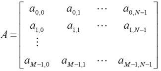

     

    
# 图像的取样和量化

+ 图像的取样：
    是把空域上或时域上连续的图像（模拟图像）转换成离散采样点（像素）集合（数字图像）的操作。 采样越细，像素越小，越能精细地表现图像。

+ 图像的量化：
    是把像素的灰度（浓淡）变换成离散的整数值的操作。量化越细致，灰度级数（浓淡层次）表现越丰富。
# 傅里叶变换
+ 定义：f(t)是t的周期函数，如果t满足狄里赫莱条件：在一个以2T为周期内f(X)连续或只有有限个第一类间断点，附f（x）单调或可划分成有限个单调区间，则F（x）以2T为周期的傅里叶级数收敛，和函数S（x）也是以2T为周期的周期函数，且在这些间断点上，函数是有限值；在一个周期内具有有限个极值点；绝对可积。则有下式成立：

    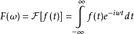
+ 傅里叶级数的本质是将一个周期信号分解成无限多分开的（离散的）正弦波。


+ 在图像处理中的作用：
    1. 图像增强与图像去噪

        绝大部分噪音都是图像的高频分量，通过低通滤波器来滤除高频——噪声; 边缘也是图像的高频分量，可以通过添加高频分量来增强原始图像的边缘；
    2. 图像分割之边缘检测

        提取图像高频分量
    3. 图像特征提取：

        形状特征：傅里叶描述
纹理特征：直接通过傅里叶系数来计算纹理特征
其他特征：将提取的特征值进行傅里叶变换来使特征具有平移、伸缩、旋转不变性
    4. 图像压缩

        可以直接通过傅里叶系数来压缩数据；常用的离散余弦变换是傅立叶变换的实变换；
# 图像滤波
+ 图像滤波，即在尽量保留图像细节特征的条件下对目标图像的噪声进行抑制，是图像预处理中不可缺少的操作，其处理效果的好坏将直接影响到后续图像处理和分析的有效性和可靠性。
+ 线性滤波可以说是图像处理最基本的方法，它可以允许我们对图像进行处理，产生很多不同的效果。做法很简单。首先，我们有一个二维的滤波器矩阵（有个高大上的名字叫卷积核or滤波器）和一个要处理的二维图像。然后，对于图像的每一个像素点，计算它的邻域像素和滤波器矩阵的对应元素的乘积，然后加起来，作为该像素位置的值。这样就完成了滤波过程。
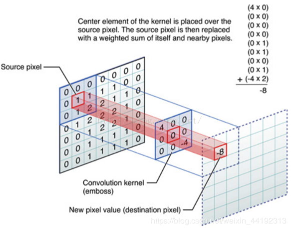
# 卷积
+ 定义：卷积可以看作是一种结合了矩阵运算的计算方法，它是是分析数学中一种重要的运算。

    设:f(x),g(x)是R1上的两个可积函数，作积分：

    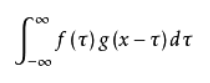

    可以证明，关于几乎所有的实数x，上述积分是存在的。这样，随着x的不同取值，这个积分就定义了一个新函数 h(x)，称为函数 f 与 g 的卷积，记为 h(x) = (f * g)(x)。
+ 卷积与傅里叶变换有着密切的关系:
两函数的傅里叶变换的乘积等于它们卷积后的傅里叶变换，能使傅里叶分析中许多问题的处理得到简化。
# 高斯模糊
+ 也叫高斯平滑，通常用它来减少图像噪声以及降低细节层次。 从数学的角度来看，图像的高斯模糊过程就是图像与正态分布做卷积。由于正态分布又叫作高斯分布，所以这项技术就叫作高斯模糊。
+ 可以理解为图像中的每个像素都重新设置像素值为周边相邻像素的平均值，这个相邻像素的范围越广，模糊程度越大。以该像素为原点，相邻像素按照其在正态曲线上的位置，分配权重，就可以得到一个加权平均值。
+ 代码：
```c++
#include <iostream>
#include <opencv2/opencv.hpp>
#define PI 3.1415926


using namespace std;
using namespace cv;

Mat customGaussianBlur(Mat src, double sigma)
{
	//生成高斯核   
	Mat gauss(5, 5, CV_64FC1);
	//构建5x5的高斯卷积核
	for (int i = -2; i <= 2; i++)
	{
		for (int j = -2; j <= 2; j++)
		{
			//计算二维高斯分布
			gauss.at<double>(i + 2, j + 2) = exp(-(i * i + j * j) / (2 * sigma * sigma))
				/ (2 * PI * sigma * sigma);
		}
	}

	//满足加权平均条件
	double gaussSum = sum(gauss).val[0];
	//权值归一化
	for (int i = -2; i <= 2; i++)
	{
		for (int j = -2; j <= 2; j++)
		{
			gauss.at<double>(i + 2, j + 2) /= gaussSum;
		}
	}

	//卷积操作    
	//首先对边缘进行补零操作，这里核大小为5x5，所以width+4, height+4
	copyMakeBorder(src, src, 2, 2, 2, 2, BORDER_CONSTANT, Scalar(0));
	//创建输出图像，同样是填充过后的
	Mat dst = src.clone();
	for (int i = 0; i < src.rows - 4; i++)
	{
		for (int j = 0; j < src.cols - 4; j++)
		{
			double sum = 0; //初始化卷积中心值

			for (int k = 0; k < gauss.rows; k++)
			{
				for (int s = 0; s < gauss.cols; s++)
				{
					//求卷积
					sum += (double)(src.at<uchar>(i + k, j + s)) * gauss.at<double>(k, s);
				}
			}
			//因为输出图像也进行了边缘填充，所以真正第一个卷积中心是(i+2,j+2)
			//可以看到，输出图像有一圈黑边,这就是没有处理到的图像边缘
			dst.at<uchar>(i + 2, j + 2) = (uchar)sum;
		}
	}
	return dst;
}

int main(int argc, const char * argv[])
{
	Mat src = imread("D:/Images/lena.jpg");
	if (src.empty()) {
		cout << "could not load the image" << endl;
		return -1;
	}
	cvtColor(src, src, CV_BGR2GRAY);
	namedWindow("src", WINDOW_AUTOSIZE);
	imshow("src", src);

	Mat dst1, dst2, dst3, dst4;
	//自定义高斯模糊
	dst1 = customGaussianBlur(src, 50);
	imshow("dst1", dst1);
	//线性平滑滤波
	blur(src, dst2, Size(5, 5), Point(-1, -1), 4);
	imshow("dst2", dst2);
	//高斯模糊
	GaussianBlur(src, dst3, Size(5, 5), 15, 0, 4);
	imshow("dst3", dst3);
	GaussianBlur(src, dst4, Size(0, 0), 15, 0, 4);
	imshow("dst4", dst4);


	waitKey(0);
	return 0;
}
```

# 其他培训代码
+ 
```c++
Mat src = imread("D:/picture/1.jpg", 1);
	cvtColor(src, src, COLOR_BGR2GRAY);//颜色空间转换
	namedWindow("src", WINDOW_AUTOSIZE);
	imshow("src", src);
```
效果：

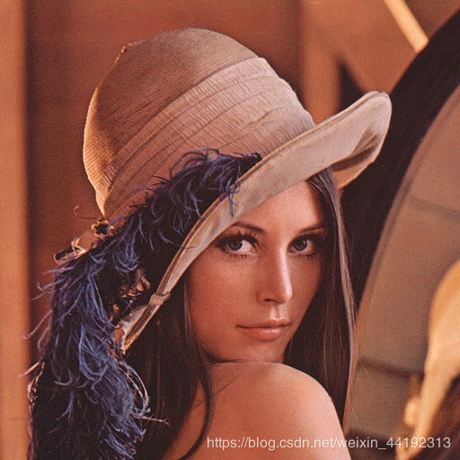
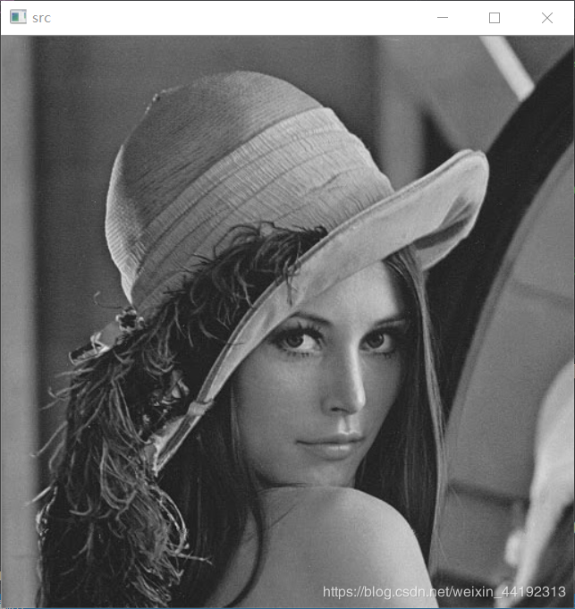

+
```c++
Mat src = imread("D:/picture/1.jpg", 1);
	cvtColor(src, src, COLOR_BGR2GRAY);//颜色空间转换
	namedWindow("src", WINDOW_AUTOSIZE);
	imshow("src", src);
    Mat dImg = Mat(src.rows, src.cols - 2, CV_8UC1);
	for (int i = 0; i < src.rows; i++)
	{
		for (int j = 1; j < src.cols - 1; j++)
		{
			dImg.at<uchar>(i, j - 1) = src.at<uchar>(i, j + 1) -
				src.at<uchar>(i, j - 1);
		}
	}
	namedWindow("dst", CV_WINDOW_AUTOSIZE);
	imshow("dst", dImg);
	waitKey(0);
```
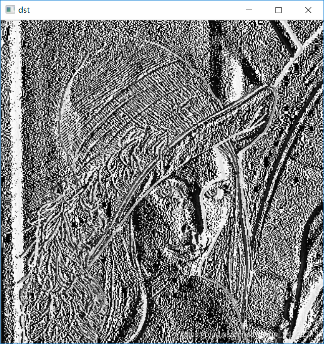


